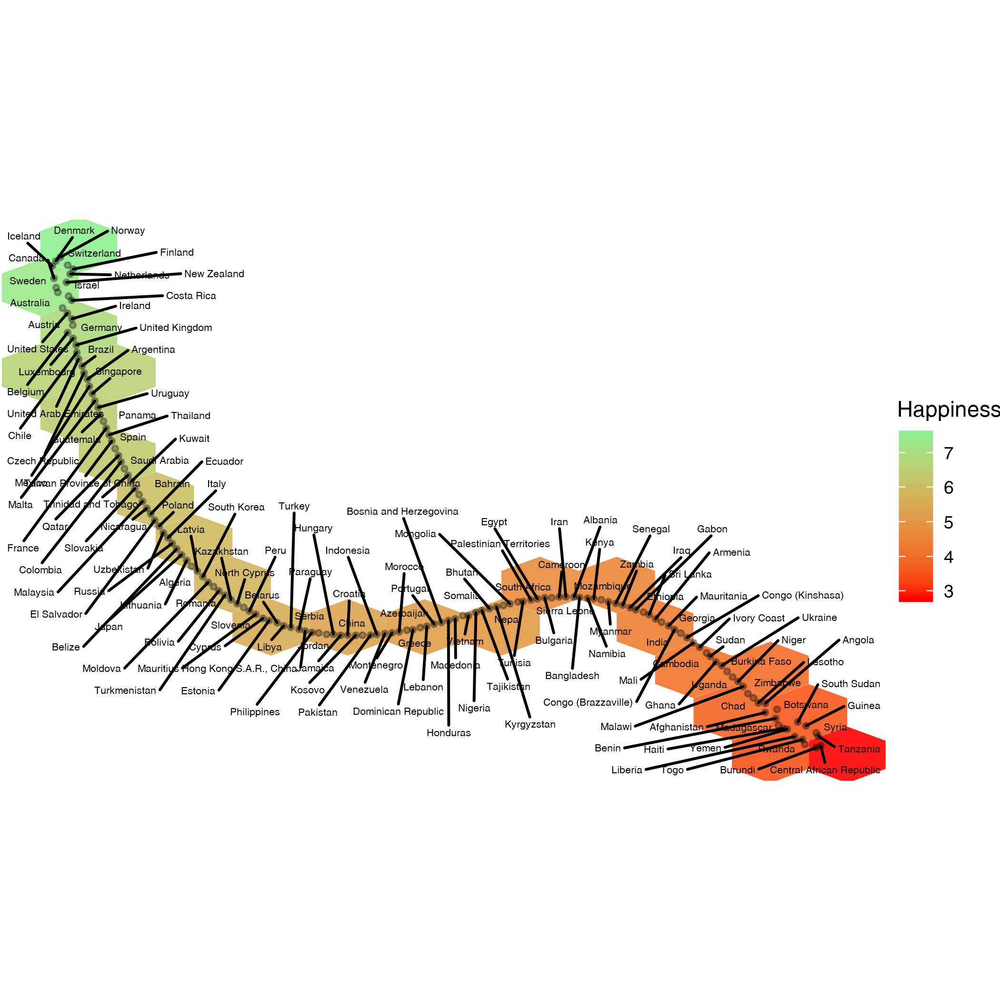
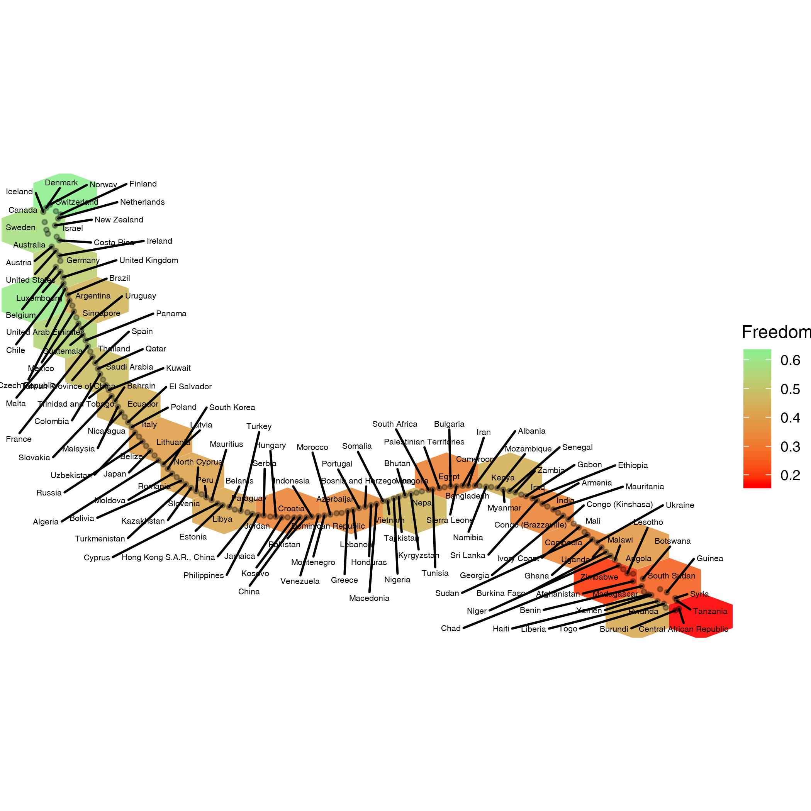
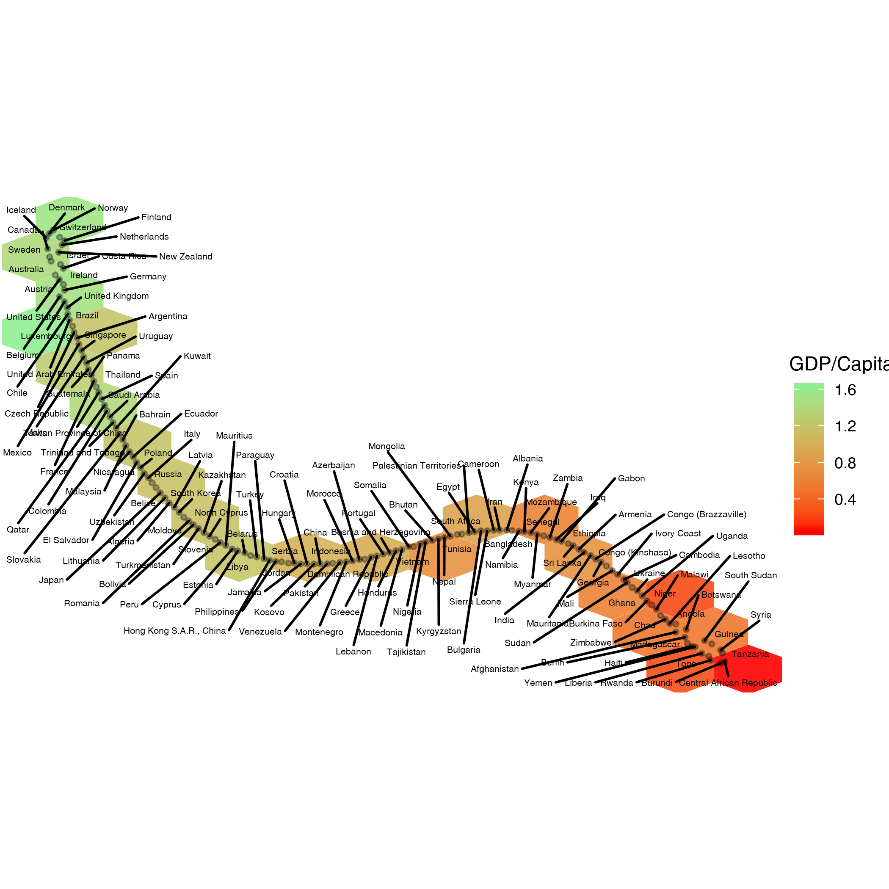

---
authors:
- admin
categories: [R,clustering, ggplot2]
date: "2019-05-31"
draft: false
featured: true
image:
  caption: ""
  focal_point: ""
projects: []
subtitle: 
summary: Use the t-SNE algorithm to perform a dimensionality redyction and plot the countries in a 2D hexmap
tags: [R, ggplot2, clustering, t-SNE]
title: Shades of happiness
---

One of my favorite task when I deal with large datasets that contains individuals and a lot of variables is to reduce the dimensionality so to understand which factors differentiate the most these individuals. There exists a lot of dimensionality reduction techniques but the most used is the Principal Components Ananlysis. After using PCA for most of my projects I discovered in this [Kaggle](https://www.kaggle.com/cherzy/spatial-representation-and-dim-reduction-t-sne) kernel a new technique that immediately raises my interest and I would like to use this new technique to analyse happiness in the world.  
I am going to work on a dataset from `Sustainable Development Solutions Network` which is hosted on here on [Kaggle](https://www.kaggle.com/unsdsn/world-happiness/downloads/world-happiness-report.zip/2). 

```R
## Loading the libraries
options(warn = -1)
suppressPackageStartupMessages(library(Rtsne))
suppressPackageStartupMessages(library(tidyverse))
suppressPackageStartupMessages(library(ggrepel))
suppressPackageStartupMessages(library(GGally))
```


```R
dataset <- read_csv("2017.csv")
```

    Parsed with column specification:
    cols(
      Country = col_character(),
      Happiness.Rank = col_double(),
      Happiness.Score = col_double(),
      Whisker.high = col_double(),
      Whisker.low = col_double(),
      Economy..GDP.per.Capita. = col_double(),
      Family = col_double(),
      Health..Life.Expectancy. = col_double(),
      Freedom = col_double(),
      Generosity = col_double(),
      Trust..Government.Corruption. = col_double(),
      Dystopia.Residual = col_double()
    )
    


```R
glimpse(dataset)
```

    Observations: 155
    Variables: 12
    $ Country                       <chr> "Norway", "Denmark", "Iceland", "Swit...
    $ Happiness.Rank                <dbl> 1, 2, 3, 4, 5, 6, 7, 8, 9, 10, 11, 12...
    $ Happiness.Score               <dbl> 7.537, 7.522, 7.504, 7.494, 7.469, 7....
    $ Whisker.high                  <dbl> 7.594445, 7.581728, 7.622030, 7.56177...
    $ Whisker.low                   <dbl> 7.479556, 7.462272, 7.385970, 7.42622...
    $ Economy..GDP.per.Capita.      <dbl> 1.616463, 1.482383, 1.480633, 1.56498...
    $ Family                        <dbl> 1.533524, 1.551122, 1.610574, 1.51691...
    $ Health..Life.Expectancy.      <dbl> 0.7966665, 0.7925655, 0.8335521, 0.85...
    $ Freedom                       <dbl> 0.6354226, 0.6260067, 0.6271626, 0.62...
    $ Generosity                    <dbl> 0.36201224, 0.35528049, 0.47554022, 0...
    $ Trust..Government.Corruption. <dbl> 0.31596383, 0.40077007, 0.15352656, 0...
    $ Dystopia.Residual             <dbl> 2.277027, 2.313707, 2.322715, 2.27671...
    

The dataset contains 155 countries with 12 socio-economic variables. All the columns, except the country names, are numeric.


```R
head(dataset)
```


<table>
<thead><tr><th scope=col>Country</th><th scope=col>Happiness.Rank</th><th scope=col>Happiness.Score</th><th scope=col>Whisker.high</th><th scope=col>Whisker.low</th><th scope=col>Economy..GDP.per.Capita.</th><th scope=col>Family</th><th scope=col>Health..Life.Expectancy.</th><th scope=col>Freedom</th><th scope=col>Generosity</th><th scope=col>Trust..Government.Corruption.</th><th scope=col>Dystopia.Residual</th></tr></thead>
<tbody>
	<tr><td>Norway     </td><td>1          </td><td>7.537      </td><td>7.594445   </td><td>7.479556   </td><td>1.616463   </td><td>1.533524   </td><td>0.7966665  </td><td>0.6354226  </td><td>0.3620122  </td><td>0.3159638  </td><td>2.277027   </td></tr>
	<tr><td>Denmark    </td><td>2          </td><td>7.522      </td><td>7.581728   </td><td>7.462272   </td><td>1.482383   </td><td>1.551122   </td><td>0.7925655  </td><td>0.6260067  </td><td>0.3552805  </td><td>0.4007701  </td><td>2.313707   </td></tr>
	<tr><td>Iceland    </td><td>3          </td><td>7.504      </td><td>7.622030   </td><td>7.385970   </td><td>1.480633   </td><td>1.610574   </td><td>0.8335521  </td><td>0.6271626  </td><td>0.4755402  </td><td>0.1535266  </td><td>2.322715   </td></tr>
	<tr><td>Switzerland</td><td>4          </td><td>7.494      </td><td>7.561772   </td><td>7.426227   </td><td>1.564980   </td><td>1.516912   </td><td>0.8581313  </td><td>0.6200706  </td><td>0.2905493  </td><td>0.3670073  </td><td>2.276716   </td></tr>
	<tr><td>Finland    </td><td>5          </td><td>7.469      </td><td>7.527542   </td><td>7.410458   </td><td>1.443572   </td><td>1.540247   </td><td>0.8091577  </td><td>0.6179509  </td><td>0.2454828  </td><td>0.3826115  </td><td>2.430182   </td></tr>
	<tr><td>Netherlands</td><td>6          </td><td>7.377      </td><td>7.427426   </td><td>7.326574   </td><td>1.503945   </td><td>1.428939   </td><td>0.8106961  </td><td>0.5853845  </td><td>0.4704898  </td><td>0.2826618  </td><td>2.294804   </td></tr>
</tbody>
</table>


Are there any missing value?


```R
map_int(dataset, function(x) sum(is.na(x)))
```


<dl class=dl-horizontal>
	<dt>Country</dt>
		<dd>0</dd>
	<dt>Happiness.Rank</dt>
		<dd>0</dd>
	<dt>Happiness.Score</dt>
		<dd>0</dd>
	<dt>Whisker.high</dt>
		<dd>0</dd>
	<dt>Whisker.low</dt>
		<dd>0</dd>
	<dt>Economy..GDP.per.Capita.</dt>
		<dd>0</dd>
	<dt>Family</dt>
		<dd>0</dd>
	<dt>Health..Life.Expectancy.</dt>
		<dd>0</dd>
	<dt>Freedom</dt>
		<dd>0</dd>
	<dt>Generosity</dt>
		<dd>0</dd>
	<dt>Trust..Government.Corruption.</dt>
		<dd>0</dd>
	<dt>Dystopia.Residual</dt>
		<dd>0</dd>
</dl>


We are good to go because there is not missing data in the dataset.


```R
# Remove the country column (non numeric) and transform the dataset to matrix
matrix_df <- dataset %>% select(-Country) %>% as.matrix
```


```R
tsne <- Rtsne(matrix_df, perplexity = 20, pca = F)
```

The tsne object contains the results of which `Y` which stores the dimensionality reduction. I'm going to store them in a tibble and bind them together with the initial dataset.


```R
results <- as_tibble(tsne$Y) %>% rename("dim1" = "V1", "dim2" = "V2") %>%
bind_cols(dataset)
```


```R
head(results)
```


<table>
<thead><tr><th scope=col>dim1</th><th scope=col>dim2</th><th scope=col>Country</th><th scope=col>Happiness.Rank</th><th scope=col>Happiness.Score</th><th scope=col>Whisker.high</th><th scope=col>Whisker.low</th><th scope=col>Economy..GDP.per.Capita.</th><th scope=col>Family</th><th scope=col>Health..Life.Expectancy.</th><th scope=col>Freedom</th><th scope=col>Generosity</th><th scope=col>Trust..Government.Corruption.</th><th scope=col>Dystopia.Residual</th></tr></thead>
<tbody>
	<tr><td>-12.99386  </td><td>12.02412   </td><td>Norway     </td><td>1          </td><td>7.537      </td><td>7.594445   </td><td>7.479556   </td><td>1.616463   </td><td>1.533524   </td><td>0.7966665  </td><td>0.6354226  </td><td>0.3620122  </td><td>0.3159638  </td><td>2.277027   </td></tr>
	<tr><td>-13.17428  </td><td>11.87064   </td><td>Denmark    </td><td>2          </td><td>7.522      </td><td>7.581728   </td><td>7.462272   </td><td>1.482383   </td><td>1.551122   </td><td>0.7925655  </td><td>0.6260067  </td><td>0.3552805  </td><td>0.4007701  </td><td>2.313707   </td></tr>
	<tr><td>-13.31577  </td><td>11.67545   </td><td>Iceland    </td><td>3          </td><td>7.504      </td><td>7.622030   </td><td>7.385970   </td><td>1.480633   </td><td>1.610574   </td><td>0.8335521  </td><td>0.6271626  </td><td>0.4755402  </td><td>0.1535266  </td><td>2.322715   </td></tr>
	<tr><td>-12.70514  </td><td>11.70555   </td><td>Switzerland</td><td>4          </td><td>7.494      </td><td>7.561772   </td><td>7.426227   </td><td>1.564980   </td><td>1.516912   </td><td>0.8581313  </td><td>0.6200706  </td><td>0.2905493  </td><td>0.3670073  </td><td>2.276716   </td></tr>
	<tr><td>-12.47832  </td><td>11.54882   </td><td>Finland    </td><td>5          </td><td>7.469      </td><td>7.527542   </td><td>7.410458   </td><td>1.443572   </td><td>1.540247   </td><td>0.8091577  </td><td>0.6179509  </td><td>0.2454828  </td><td>0.3826115  </td><td>2.430182   </td></tr>
	<tr><td>-12.60136  </td><td>11.35498   </td><td>Netherlands</td><td>6          </td><td>7.377      </td><td>7.427426   </td><td>7.326574   </td><td>1.503945   </td><td>1.428939   </td><td>0.8106961  </td><td>0.5853845  </td><td>0.4704898  </td><td>0.2826618  </td><td>2.294804   </td></tr>
</tbody>
</table>


```R

```


```R
tsne_hexmap <- function(data = results, name = NULL, variable) {
    ggplot() +
  stat_summary_hex(data = data, 
                   aes_string(x="dim1", y="dim2", z =  variable), 
                   bins=10, fun = mean, alpha = 0.9) +
  geom_point(data = results, aes_string(x = "dim1", y = "dim2"), 
             alpha = 0.3, size = 1, col = 'black') +
    scale_fill_gradient(high = 'lightgreen', low = 'red', name=name) +
  coord_fixed(ratio = 1) +
  theme_void() +
geom_text_repel(data = data, 
                aes_string(x = "dim1", y = "dim2", label = "Country"), 
                size = 1.7, col = 'black') +
    theme(plot.title = element_text(hjust = 0.5),
       legend.title.align=0.5)
}
```

## Happiness


```R
tsne_hexmap(name = "Happiness", variable = "Happiness.Score")
```





## Freedom


```R
tsne_hexmap(name = "Freedom", variable = "Freedom")
```




## GDP/Capita

```R
tsne_hexmap(name = "GDP/Capita", variable = "Economy..GDP.per.Capita.")
```




