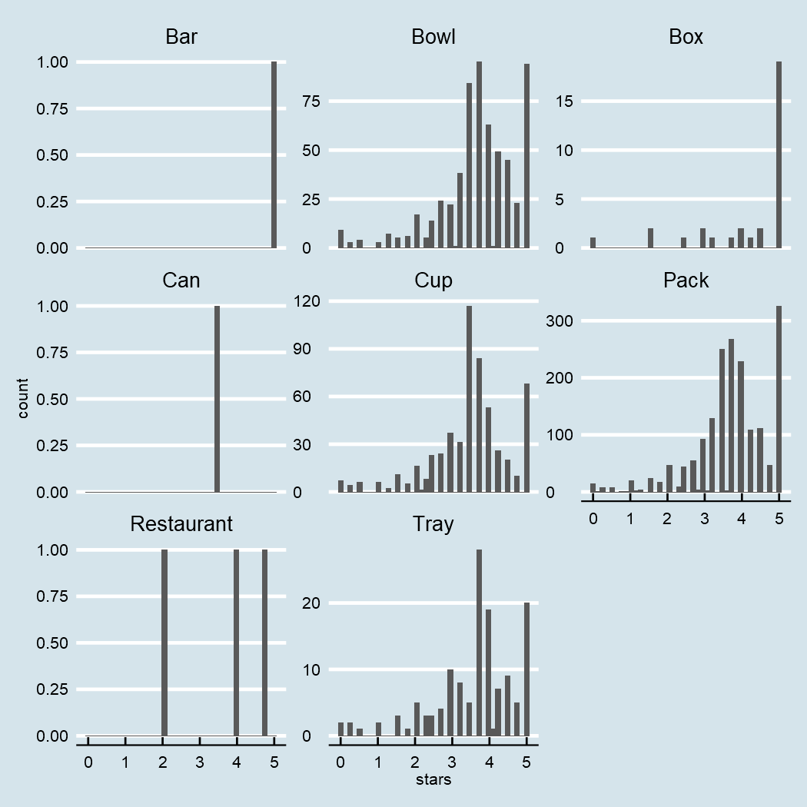
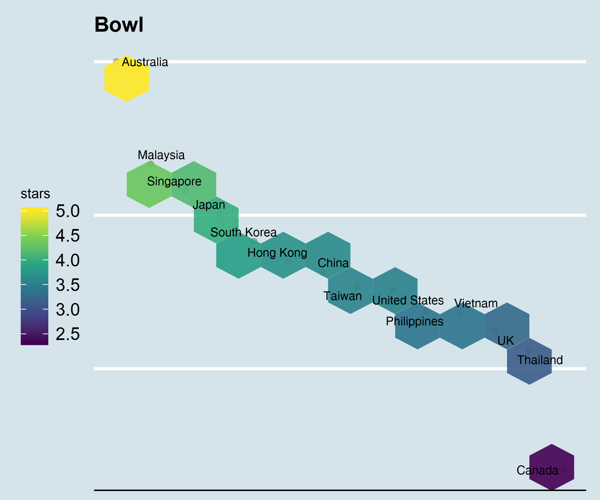
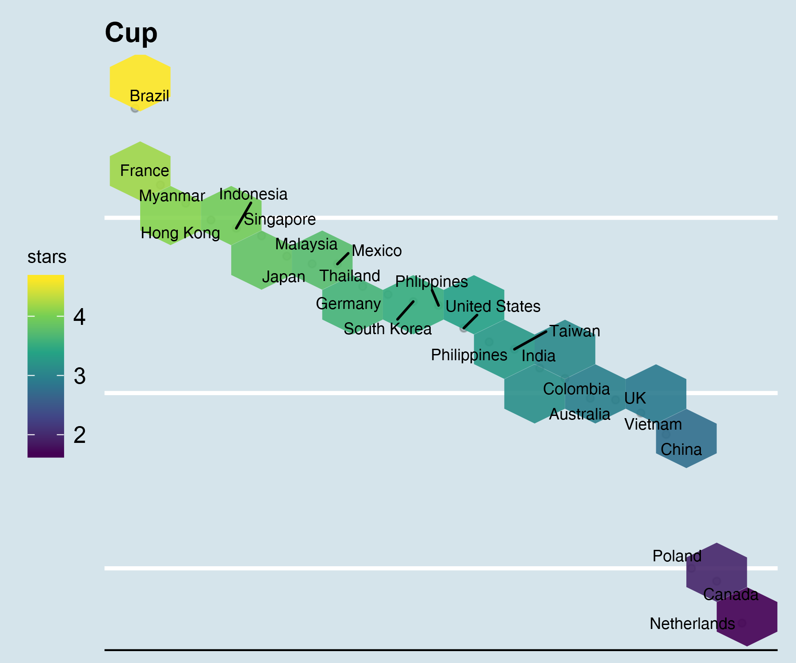

---
authors:
- admin
categories: [R,Tidytuesday]
date: "2019-06-04"
draft: false
featured: true
image:
  caption: ""
  focal_point: ""
projects: []
subtitle: 
summary: Make cool graphs with R
tags: [R, ggplot2, tidytuesday]
title: My fist Tidytuesday
---
# My first `Tidytuesday`

I've discovered the `Tidytuesday` event on Twitter via this tweet.  
 

I really love the concept and I think it's a good way to share code and learn visualization techniques.   
This week the theme is about Ramens and here's my participation !


```R
ramen_ratings <- readr::read_csv("https://raw.githubusercontent.com/rfordatascience/tidytuesday/master/data/2019/2019-06-04/ramen_ratings.csv")
```

    Parsed with column specification:
    cols(
      review_number = col_double(),
      brand = col_character(),
      variety = col_character(),
      style = col_character(),
      country = col_character(),
      stars = col_double()
    )
    


```R
library(tidyverse)
library(ggrepel)
library(cowplot)
library(ggthemes)
```

    
    Attaching package: 'ggthemes'
    
    The following object is masked from 'package:cowplot':
    
        theme_map
    
    


```R
map_int(ramen_ratings, function(x) length(unique(x)))
```


<dl class=dl-horizontal>
	<dt>review_number</dt>
		<dd>3178</dd>
	<dt>brand</dt>
		<dd>456</dd>
	<dt>variety</dt>
		<dd>2971</dd>
	<dt>style</dt>
		<dd>9</dd>
	<dt>country</dt>
		<dd>44</dd>
	<dt>stars</dt>
		<dd>40</dd>
</dl>


```R
ramen_no_na <- ramen_ratings %>% na.omit
```


```R
map_int(ramen_no_na, function(x) length(unique(x)))
```


<dl class=dl-horizontal>
	<dt>review_number</dt>
		<dd>3161</dd>
	<dt>brand</dt>
		<dd>454</dd>
	<dt>variety</dt>
		<dd>2955</dd>
	<dt>style</dt>
		<dd>8</dd>
	<dt>country</dt>
		<dd>44</dd>
	<dt>stars</dt>
		<dd>39</dd>
</dl>


```R
options(repr.plot.res = 150)
ramen_no_na %>% ggplot(aes(x = stars)) + 
geom_histogram(bins = 40) + facet_wrap(~style, scales = "free_y") +
theme_economist()
```





I will only plot the styles with high rating counts.


```R
ramen_no_na <- ramen_no_na %>% 
mutate(country = str_replace(string = country, 
                             pattern = "USA", replacement = "United States"))
```


```R
options(repr.plot.res = 300, repr.plot.width = 6, repr.plot.height = 5)
ramen_no_na %>% filter(style == "Pack") %>%
group_by(country) %>% summarize( mean_rating = mean(stars)) %>%
arrange(desc(mean_rating)) %>% mutate(rank = 1:length(country)) %>%
ggplot(aes(y = mean_rating, x = rank)) + geom_point(alpha = 0.2) + 
stat_summary_hex(aes(z =  mean_rating), 
                   bins=20, fun = mean, alpha = 0.9) + 
geom_text_repel(aes(label = country), 
                size = 2, col = 'black') + 
scale_fill_gradient(high = 'green', low = 'red', name="Average stars") +
labs(title = "Pack") + theme_economist() + 
theme(legend.position = "left", legend.key.size = unit(7, "mm"),
      axis.title.y = element_blank(), axis.text.y = element_blank(),
     axis.title.x = element_blank(), axis.ticks.x = element_blank() ,axis.text.x = element_blank())
```


```R
options(repr.plot.res = 300, repr.plot.width = 6, repr.plot.height = 5)
ramen_no_na %>% filter(style == "Bowl") %>%
group_by(country) %>% summarize( mean_rating = mean(stars)) %>%
arrange(desc(mean_rating)) %>% mutate(rank = 1:length(country)) %>%
ggplot(aes(y = mean_rating, x = rank)) + geom_point(alpha = 0.2) + 
stat_summary_hex(aes(z =  mean_rating), 
                   bins=20, fun = mean, alpha = 0.9) + 
geom_text_repel(aes(label = country), 
                size = 2, col = 'black') + 
scale_fill_gradient(high = 'green', low = 'red', name="Average stars") +
labs(title = "Bowl") + theme_economist() + 
theme(legend.position = "left", legend.key.size = unit(7, "mm"),
      axis.title.y = element_blank(), axis.text.y = element_blank(),
     axis.title.x = element_blank(), axis.text.x = element_blank())
```


```R
options(repr.plot.res = 300, repr.plot.width = 6, repr.plot.height = 5)
ramen_no_na %>% filter(style == "Cup") %>%
group_by(country) %>% summarize( mean_rating = mean(stars)) %>%
arrange(desc(mean_rating)) %>% mutate(rank = 1:length(country)) %>%
ggplot(aes(y = mean_rating, x = rank)) + geom_point(alpha = 0.2) + 
stat_summary_hex(aes(z =  mean_rating), 
                   bins=20, fun = mean, alpha = 0.9) + 
geom_text_repel(aes(label = country), 
                size = 2, col = 'black') + 
scale_fill_gradient(high = 'green', low = 'red', name="Average stars") +
labs(title = "Cup") + theme_economist() + 
theme(legend.position = "left", legend.key.size = unit(7, "mm"),
      axis.title.y = element_blank(), axis.text.y = element_blank(),
     axis.title.x = element_blank(), axis.text.x = element_blank())
```





```R
options(repr.plot.res = 300, repr.plot.width = 6, repr.plot.height = 5)
ramen_no_na %>% filter(style == "Tray") %>%
group_by(country) %>% summarize( mean_rating = mean(stars)) %>%
arrange(desc(mean_rating)) %>% mutate(rank = 1:length(country)) %>%
ggplot(aes(y = mean_rating, x = rank)) + geom_point(alpha = 0.2) + 
stat_summary_hex(aes(z =  mean_rating), 
                   bins=20, fun = mean, alpha = 0.9) + 
geom_text_repel(aes(label = country), 
                size = 2, col = 'black') + 
scale_fill_gradient(high = 'green', low = 'red', name="Average stars") +
labs(title = "Tray") + theme_economist() + 
theme(legend.position = "left", legend.key.size = unit(7, "mm"),
      axis.title.y = element_blank(), axis.text.y = element_blank(),
     axis.title.x = element_blank(), axis.ticks.x = element_blank() ,axis.text.x = element_blank())
```





```R

```
