---
authors:
- admin
categories: [Python, Econométrie]
date: "2019-04-19"
draft: false
featured: true
image:
  caption: ""
  focal_point: ""
projects: []
subtitle: 
summary: Ce projet implémente en Python la trame générale d'une étude économétrique. Il s'agit d'estimer la relation linéaire entre le revenu et la consommation
tags: [Python, pandas, statsmodels]
title: Estimer la relation linéaire entre le revenu et la consommation (python)
J'aimerais dans cet article réaliser une étude économétrique à partir d'une base de donnée regroupant des indicateurs économétriques sur la France de 1962 à 2012. Il sera question de nettoyer la base pour la préparer à la visualisation des séries temporelles, pour réaliser des statistiques descriptives, analyser les correlations entre les variables de la base de donnée. 
---

```python
# importation des librairies
%matplotlib inline
import numpy as np
import pandas as pd
import seaborn as sns
import matplotlib.pyplot as plt
```


```python
# Paramètres graphiques
plt.rcParams["figure.figsize"] = [12,6]
plt.rcParams["figure.dpi"] = 150
plt.style.use("fivethirtyeight")
```


```python
base = pd.read_excel("DATABASE1963-2012.xls")
```

Regardons comment se présente la base


```python
base.head()
```


<div>
<style scoped>
    .dataframe tbody tr th:only-of-type {
        vertical-align: middle;
    }

    .dataframe tbody tr th {
        vertical-align: top;
    }

    .dataframe thead th {
        text-align: right;
    }
</style>
<table border="1" class="dataframe">
  <thead>
    <tr style="text-align: right;">
      <th></th>
      <th>OBS</th>
      <th>UN</th>
      <th>Unnamed: 2</th>
      <th>CPC</th>
      <th>DAT</th>
      <th>DLT</th>
      <th>DP</th>
      <th>DSPS</th>
      <th>DUC</th>
      <th>GPG</th>
      <th>...</th>
      <th>TDE</th>
      <th>TE</th>
      <th>TINFL</th>
      <th>TPRES</th>
      <th>TR</th>
      <th>TSP</th>
      <th>W</th>
      <th>XPX</th>
      <th>YPY</th>
      <th>TEF</th>
    </tr>
  </thead>
  <tbody>
    <tr>
      <th>0</th>
      <td>1</td>
      <td>1</td>
      <td>1963-1</td>
      <td>274.252399</td>
      <td>1859.226699</td>
      <td>40.0</td>
      <td>14.999408</td>
      <td>4.575718</td>
      <td>82.798301</td>
      <td>103.402718</td>
      <td>...</td>
      <td>25.207117</td>
      <td>19.547539</td>
      <td>5.160079</td>
      <td>32.019116</td>
      <td>6.465074</td>
      <td>-0.142149</td>
      <td>0.759338</td>
      <td>33.289599</td>
      <td>476.046181</td>
      <td>8.815188</td>
    </tr>
    <tr>
      <th>1</th>
      <td>2</td>
      <td>1</td>
      <td>1963-2</td>
      <td>279.979818</td>
      <td>1876.450261</td>
      <td>40.0</td>
      <td>16.075849</td>
      <td>1.588363</td>
      <td>84.328672</td>
      <td>105.287914</td>
      <td>...</td>
      <td>25.919505</td>
      <td>18.990496</td>
      <td>4.982553</td>
      <td>32.541230</td>
      <td>6.482865</td>
      <td>0.302659</td>
      <td>0.767427</td>
      <td>33.197693</td>
      <td>486.892013</td>
      <td>7.582511</td>
    </tr>
    <tr>
      <th>2</th>
      <td>3</td>
      <td>1</td>
      <td>1963-3</td>
      <td>284.897175</td>
      <td>1887.905376</td>
      <td>40.0</td>
      <td>16.901766</td>
      <td>-0.326363</td>
      <td>85.182034</td>
      <td>107.088900</td>
      <td>...</td>
      <td>26.345618</td>
      <td>18.640453</td>
      <td>4.705747</td>
      <td>32.955774</td>
      <td>6.457475</td>
      <td>0.616460</td>
      <td>0.776522</td>
      <td>33.452026</td>
      <td>496.462215</td>
      <td>6.721496</td>
    </tr>
    <tr>
      <th>3</th>
      <td>4</td>
      <td>1</td>
      <td>1963-4</td>
      <td>289.130436</td>
      <td>1894.530152</td>
      <td>40.0</td>
      <td>17.505219</td>
      <td>-1.354848</td>
      <td>85.477076</td>
      <td>108.809399</td>
      <td>...</td>
      <td>26.518268</td>
      <td>18.465213</td>
      <td>4.357520</td>
      <td>33.274753</td>
      <td>6.402607</td>
      <td>0.816080</td>
      <td>0.786548</td>
      <td>33.995435</td>
      <td>504.953332</td>
      <td>6.172891</td>
    </tr>
    <tr>
      <th>4</th>
      <td>5</td>
      <td>1</td>
      <td>1964-1</td>
      <td>292.752877</td>
      <td>1897.266903</td>
      <td>40.0</td>
      <td>17.909676</td>
      <td>-1.687237</td>
      <td>85.340560</td>
      <td>110.427187</td>
      <td>...</td>
      <td>26.473363</td>
      <td>18.431377</td>
      <td>3.972974</td>
      <td>33.507235</td>
      <td>6.333507</td>
      <td>0.917762</td>
      <td>0.797246</td>
      <td>34.755299</td>
      <td>512.449470</td>
      <td>5.879116</td>
    </tr>
  </tbody>
</table>
<p>5 rows × 39 columns</p>
</div>


Il s'agit d'une base de donnée économique regroupant des variables macroéconomiques sur la France. Nous n'allons pas détailler tous les noms des variables, mais nous tâcherons d'expliquer les variables que nous utiliserons pour notre analyse.

## Statistiques descriptives


```python
base.shape
```


    (200, 39)


Notre base de donnée est constituée de 200 observations et de 39 variables. 


```python
base.describe()
```


<div>
<style scoped>
    .dataframe tbody tr th:only-of-type {
        vertical-align: middle;
    }

    .dataframe tbody tr th {
        vertical-align: top;
    }

    .dataframe thead th {
        text-align: right;
    }
</style>
<table border="1" class="dataframe">
  <thead>
    <tr style="text-align: right;">
      <th></th>
      <th>OBS</th>
      <th>UN</th>
      <th>CPC</th>
      <th>DAT</th>
      <th>DLT</th>
      <th>DP</th>
      <th>DSPS</th>
      <th>DUC</th>
      <th>GPG</th>
      <th>H</th>
      <th>...</th>
      <th>TDE</th>
      <th>TE</th>
      <th>TINFL</th>
      <th>TPRES</th>
      <th>TR</th>
      <th>TSP</th>
      <th>W</th>
      <th>XPX</th>
      <th>YPY</th>
      <th>TEF</th>
    </tr>
  </thead>
  <tbody>
    <tr>
      <th>count</th>
      <td>200.000000</td>
      <td>200.0</td>
      <td>200.000000</td>
      <td>200.000000</td>
      <td>200.000000</td>
      <td>200.000000</td>
      <td>200.000000</td>
      <td>200.000000</td>
      <td>200.000000</td>
      <td>200.000000</td>
      <td>...</td>
      <td>200.000000</td>
      <td>200.000000</td>
      <td>200.000000</td>
      <td>200.000000</td>
      <td>200.000000</td>
      <td>200.000000</td>
      <td>200.000000</td>
      <td>200.000000</td>
      <td>200.000000</td>
      <td>200.000000</td>
    </tr>
    <tr>
      <th>mean</th>
      <td>100.500000</td>
      <td>1.0</td>
      <td>667.976435</td>
      <td>1581.860187</td>
      <td>38.320205</td>
      <td>495.842394</td>
      <td>-1.434067</td>
      <td>84.338210</td>
      <td>289.095131</td>
      <td>131.821682</td>
      <td>...</td>
      <td>40.329048</td>
      <td>16.694269</td>
      <td>4.666106</td>
      <td>40.115857</td>
      <td>7.232212</td>
      <td>-2.400353</td>
      <td>8.899128</td>
      <td>232.055791</td>
      <td>1204.883787</td>
      <td>5.687504</td>
    </tr>
    <tr>
      <th>std</th>
      <td>57.879185</td>
      <td>0.0</td>
      <td>219.857030</td>
      <td>161.707290</td>
      <td>2.026990</td>
      <td>519.926384</td>
      <td>8.667881</td>
      <td>2.804489</td>
      <td>105.181059</td>
      <td>13.475607</td>
      <td>...</td>
      <td>21.782975</td>
      <td>2.796075</td>
      <td>3.852316</td>
      <td>3.975054</td>
      <td>3.768669</td>
      <td>2.064637</td>
      <td>5.940982</td>
      <td>153.442257</td>
      <td>401.474897</td>
      <td>1.714773</td>
    </tr>
    <tr>
      <th>min</th>
      <td>1.000000</td>
      <td>1.0</td>
      <td>274.252399</td>
      <td>1378.022919</td>
      <td>34.284686</td>
      <td>14.999408</td>
      <td>-18.214287</td>
      <td>72.446980</td>
      <td>103.402718</td>
      <td>114.835243</td>
      <td>...</td>
      <td>12.693384</td>
      <td>10.877190</td>
      <td>-0.384555</td>
      <td>32.019116</td>
      <td>0.167617</td>
      <td>-8.265285</td>
      <td>0.759338</td>
      <td>33.197693</td>
      <td>476.046181</td>
      <td>0.323111</td>
    </tr>
    <tr>
      <th>25%</th>
      <td>50.750000</td>
      <td>1.0</td>
      <td>486.067715</td>
      <td>1426.873623</td>
      <td>35.244837</td>
      <td>36.631097</td>
      <td>-7.761538</td>
      <td>83.108515</td>
      <td>199.082330</td>
      <td>118.906135</td>
      <td>...</td>
      <td>20.953342</td>
      <td>14.739361</td>
      <td>1.900946</td>
      <td>35.800408</td>
      <td>3.723566</td>
      <td>-3.377893</td>
      <td>2.677703</td>
      <td>105.780221</td>
      <td>884.587609</td>
      <td>4.991652</td>
    </tr>
    <tr>
      <th>50%</th>
      <td>100.500000</td>
      <td>1.0</td>
      <td>678.466020</td>
      <td>1529.531753</td>
      <td>39.000379</td>
      <td>292.753615</td>
      <td>-1.415239</td>
      <td>84.607695</td>
      <td>301.039485</td>
      <td>127.460979</td>
      <td>...</td>
      <td>33.357799</td>
      <td>15.936473</td>
      <td>2.858203</td>
      <td>41.823950</td>
      <td>7.539372</td>
      <td>-2.512027</td>
      <td>9.335488</td>
      <td>173.734371</td>
      <td>1189.764734</td>
      <td>6.027491</td>
    </tr>
    <tr>
      <th>75%</th>
      <td>150.250000</td>
      <td>1.0</td>
      <td>854.507537</td>
      <td>1710.212066</td>
      <td>39.999998</td>
      <td>825.963580</td>
      <td>4.709407</td>
      <td>86.007016</td>
      <td>374.805154</td>
      <td>142.517672</td>
      <td>...</td>
      <td>59.287390</td>
      <td>19.152971</td>
      <td>6.700211</td>
      <td>43.245983</td>
      <td>10.365802</td>
      <td>-0.832687</td>
      <td>14.051128</td>
      <td>409.184189</td>
      <td>1586.473061</td>
      <td>6.670885</td>
    </tr>
    <tr>
      <th>max</th>
      <td>200.000000</td>
      <td>1.0</td>
      <td>1013.837952</td>
      <td>1897.266903</td>
      <td>40.179177</td>
      <td>1859.217287</td>
      <td>24.796444</td>
      <td>90.185537</td>
      <td>457.730691</td>
      <td>158.105575</td>
      <td>...</td>
      <td>91.179840</td>
      <td>22.687047</td>
      <td>14.242208</td>
      <td>45.382268</td>
      <td>15.817231</td>
      <td>0.942276</td>
      <td>18.945301</td>
      <td>518.429723</td>
      <td>1812.921288</td>
      <td>9.400338</td>
    </tr>
  </tbody>
</table>
<p>8 rows × 38 columns</p>
</div>


On remarque qu'il y a une colonne qui ne nous dit pas grand chose sur les données. C'est la colonne `UN` qui prend partout 1.  
A la lecture de la base il y avait une colonne appélée `Unnamed`. Nous allons essayer de la corriger

## Signification des libéllés

PY PRIX DE LA PRODUCTION (PIB)   
PINV PRIX DE L’INVESTISSEMENT   
PM PRIX DES IMPORTATIONS  
PX PRIX DES EXPORTATIONS   
PG PRIX DES DEPENSES PUBLIQUES   
PDI PRIX DE LA DEMANDE INTERIEURE   
PC PRIX DE LA CONSOMMATION   
L EMPLOI TOTAL  
PAP POPULATION ACTIVE   
POP POPULATION TOTALE  
YPY PIB en volume 
INVP FBCF en volume   
CPC CONSOMATION DES MENAGES en volume   
XPX EXPORTATIONS en volume   
MPM IMPORTATIONS en volume   
RD REVENU DISPONIBLE en volume   
GPG CONSOMMATION DE L’ETAT (dépenses publiques) en volume  
K CAPITAL   
DSPS VARIATION DE STOCKS en volume  
TCHO TAUX DE CHOMAGE en %   
TINFL TAUX D’INFLATION en %   
TPRES TAUX DE PRELEVEMENT OBLIGATOIRE en % du PIB   
TCOT TAUX DE COTISATION SOCIALES DES MENAGES en %   
DUC DEGRES D’UTILISATION DES CAPACITE DE PRODUCTION en %  
DAT DUREE ANNUELLE DU TRAVAIL en heure/personne  
DLT DUREE LEGALE DU TRAVAIL en heure  
H DUREE MENSUELLE DU TRAVAIL en heure/personne  
DP DETTE PUBLIQUE en valeur   
SP SOLDE PUBLIQUE en valeur  
TDE DETTE PUBLIQUE en % du PIB   
TE TAUX D’EPARGNE DES MENAGES   
TSP SOLDE PUBLIQUE (DEFICIT) en % du PIB  
TR EURIBOR 3 mois
W SALAIRE  


```python
base["Unnamed: 2"].head()
```


    0    1963-1
    1    1963-2
    2    1963-3
    3    1963-4
    4    1964-1
    Name: Unnamed: 2, dtype: object


```python
base["Unnamed: 2"].tail()
```


    195    2011-T4
    196    2012-T1
    197    2012-T2
    198    2012-T3
    199    2012-T4
    Name: Unnamed: 2, dtype: object


Il s'agit de 200 périodes de temps commençant du premier semestre de 1964 au quatrième semestre de l'année 2012. Ce type de donnée n'est pas correctement lue par Pandas, nous devons donc résoudre celà pour pouvoir visualiser les séries temporelles.


```python
# Commençons par nommer la colonnes
base = base.rename({"Unnamed: 2":"Année"}, axis= 1)
```


```python
base["Année"].head(3)
```


    0    1963-1
    1    1963-2
    2    1963-3
    Name: Année, dtype: object


```python
base["Année"].tail(3)
```


    197    2012-T2
    198    2012-T3
    199    2012-T4
    Name: Année, dtype: object


```python
import warnings
warnings.filterwarnings("ignore")
```


```python
# Générons une série temporelle
pd.date_range(start = "1963/01", end = "2012/12", freq= "3 m")
```


    DatetimeIndex(['1963-01-31', '1963-04-30', '1963-07-31', '1963-10-31',
                   '1964-01-31', '1964-04-30', '1964-07-31', '1964-10-31',
                   '1965-01-31', '1965-04-30',
                   ...
                   '2010-07-31', '2010-10-31', '2011-01-31', '2011-04-30',
                   '2011-07-31', '2011-10-31', '2012-01-31', '2012-04-30',
                   '2012-07-31', '2012-10-31'],
                  dtype='datetime64[ns]', length=200, freq='3M')


```python
# On peut remplacer l'année par cette série
base["Année"] = pd.date_range(start = "1963/01", end = "2012/12", freq= "3 m")
```


```python
base.head(3)
```


<div>
<style scoped>
    .dataframe tbody tr th:only-of-type {
        vertical-align: middle;
    }

    .dataframe tbody tr th {
        vertical-align: top;
    }

    .dataframe thead th {
        text-align: right;
    }
</style>
<table border="1" class="dataframe">
  <thead>
    <tr style="text-align: right;">
      <th></th>
      <th>OBS</th>
      <th>UN</th>
      <th>Année</th>
      <th>CPC</th>
      <th>DAT</th>
      <th>DLT</th>
      <th>DP</th>
      <th>DSPS</th>
      <th>DUC</th>
      <th>GPG</th>
      <th>...</th>
      <th>TDE</th>
      <th>TE</th>
      <th>TINFL</th>
      <th>TPRES</th>
      <th>TR</th>
      <th>TSP</th>
      <th>W</th>
      <th>XPX</th>
      <th>YPY</th>
      <th>TEF</th>
    </tr>
  </thead>
  <tbody>
    <tr>
      <th>0</th>
      <td>1</td>
      <td>1</td>
      <td>1963-01-31</td>
      <td>274.252399</td>
      <td>1859.226699</td>
      <td>40.0</td>
      <td>14.999408</td>
      <td>4.575718</td>
      <td>82.798301</td>
      <td>103.402718</td>
      <td>...</td>
      <td>25.207117</td>
      <td>19.547539</td>
      <td>5.160079</td>
      <td>32.019116</td>
      <td>6.465074</td>
      <td>-0.142149</td>
      <td>0.759338</td>
      <td>33.289599</td>
      <td>476.046181</td>
      <td>8.815188</td>
    </tr>
    <tr>
      <th>1</th>
      <td>2</td>
      <td>1</td>
      <td>1963-04-30</td>
      <td>279.979818</td>
      <td>1876.450261</td>
      <td>40.0</td>
      <td>16.075849</td>
      <td>1.588363</td>
      <td>84.328672</td>
      <td>105.287914</td>
      <td>...</td>
      <td>25.919505</td>
      <td>18.990496</td>
      <td>4.982553</td>
      <td>32.541230</td>
      <td>6.482865</td>
      <td>0.302659</td>
      <td>0.767427</td>
      <td>33.197693</td>
      <td>486.892013</td>
      <td>7.582511</td>
    </tr>
    <tr>
      <th>2</th>
      <td>3</td>
      <td>1</td>
      <td>1963-07-31</td>
      <td>284.897175</td>
      <td>1887.905376</td>
      <td>40.0</td>
      <td>16.901766</td>
      <td>-0.326363</td>
      <td>85.182034</td>
      <td>107.088900</td>
      <td>...</td>
      <td>26.345618</td>
      <td>18.640453</td>
      <td>4.705747</td>
      <td>32.955774</td>
      <td>6.457475</td>
      <td>0.616460</td>
      <td>0.776522</td>
      <td>33.452026</td>
      <td>496.462215</td>
      <td>6.721496</td>
    </tr>
  </tbody>
</table>
<p>3 rows × 39 columns</p>
</div>


Nous pouvons maintenant enlever les colonnes `OBS`, et `UN` et choisir la colonne `Année` comme l'index de notre base.


```python
base.drop(columns= ["OBS", "UN"], inplace= True)
```


```python
# Définissons Année comme indice
base.set_index("Année", inplace= True)
```

## Distribution des colonnes de la base de donnée

Nous allons maintenant essayer de regarder comment sont distribuées les colonnes de notre base données. Et regarder comment elles sont corrélées entre elles.

La librairie `Seaborn` est très puissante pour l'analyse exploratoire des données car elle ajoute à `matplotlib` des types de graphiques inédits.


```python
base.columns
```


    Index(['CPC', 'DAT', 'DLT', 'DP', 'DSPS', 'DUC', 'GPG', 'H', 'INVP', 'K', 'L',
           'MPM', 'PAP', 'PC', 'PDI', 'PG', 'PINV', 'PM', 'POP', 'PX', 'PY', 'RD',
           'SP', 'TCHO', 'TCHO.1', 'TCOT', 'TDE', 'TE', 'TINFL', 'TPRES', 'TR',
           'TSP', 'W', 'XPX', 'YPY', 'TEF'],
          dtype='object')


Etant donné qu'il y a plus de 30 variables dans la base de donnée, nous n'allons représenter que les 7 premières dans un pairplot (le principe est de représenter des combinaisons de deux variables).


```python
sns.pairplot(base.iloc[:, 1:7], diag_kind= "kde")
```


    <seaborn.axisgrid.PairGrid at 0x1e9cd587d30>


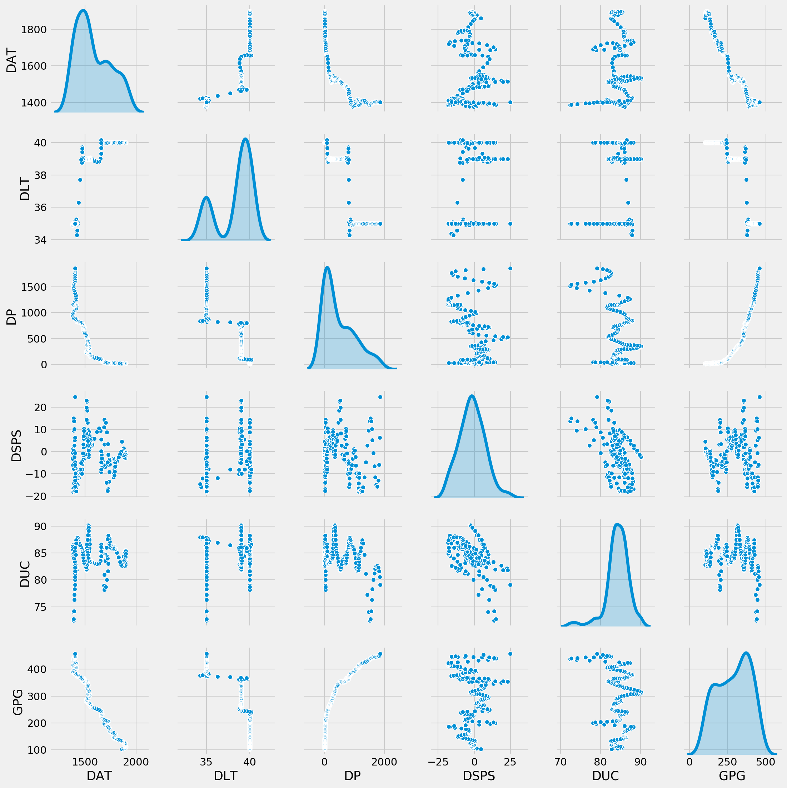


## Mesure de la correlation entre les variables


```python
#base.corr()
```


```python
plt.figure(figsize = (14,8))
sns.heatmap(base.corr(), cmap= "viridis")
```


    <matplotlib.axes._subplots.AxesSubplot at 0x1e9d04f3da0>


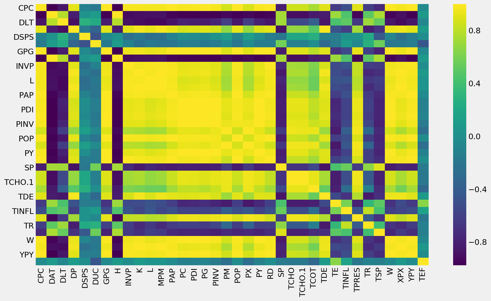


Ce graphique est une représentation de la matrice des correlations. EN diagonale la correlation vaut 1 car la variable corrèle avec elle-même.  
D'une vue globale, ce qu'on remarque c'est que la plupart des variables sont corrélées entre elles.  
Si on veut facilement répérer visuellement quelles variables sont corrélées entre elles, on peut utiliser l'algorithme de classification hiérarchique pour visualiser. 


```python
sns.clustermap(base.corr(), cmap = "viridis")
```


    <seaborn.matrix.ClusterGrid at 0x1e9d1a33c18>


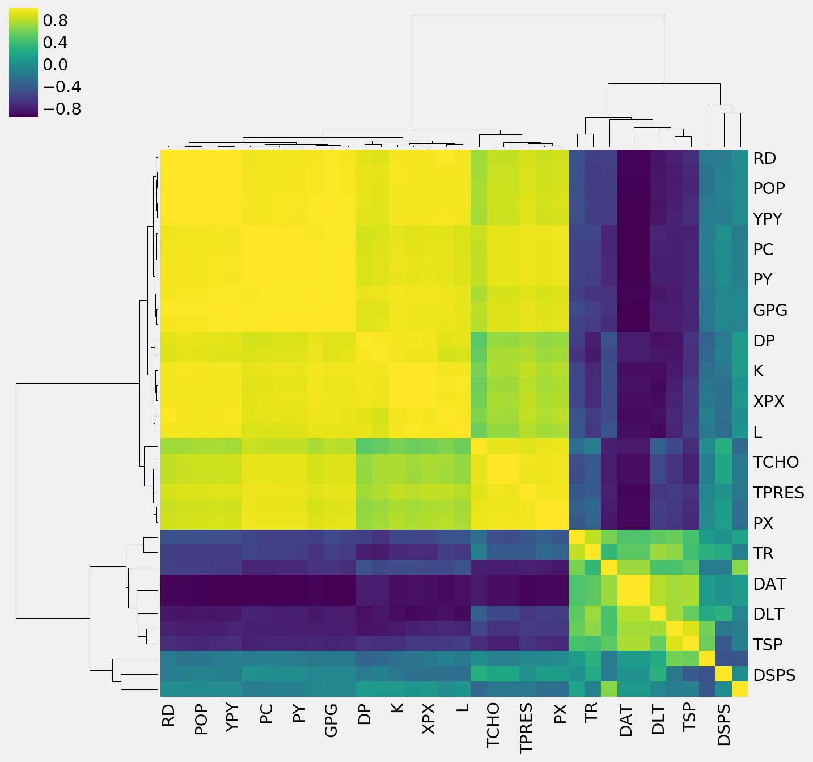


Plus la couleur tend vers jaune, plus forte est la correlation. on remarque dans la partie gauche du graphique un fort regroupement des variables.  
On remarque que le revenu disponible (RD) corrèle très fortement avec plusieurs variables dont la population totale, le prix de la production, le prix de la consommation. Ces correlations ne traduisent en rien une causalité, elles signifient seulement que ces variables évoluent dans le même sens.

# Visualisation des séries temporelles

Après avoir transformée notre colonne année en indice, nous pouvons facilement représenter la série temporelle des variables.  
Intéressons-nous, pour commencer à l'évolution du taux de chômage en France depuis les années 1960


```python
base["TCHO"].plot()
plt.title("Taux de chômage en France de 1960 à 2012")
plt.ylabel("Taux de chômage")
```


    Text(0, 0.5, 'Taux de chômage')


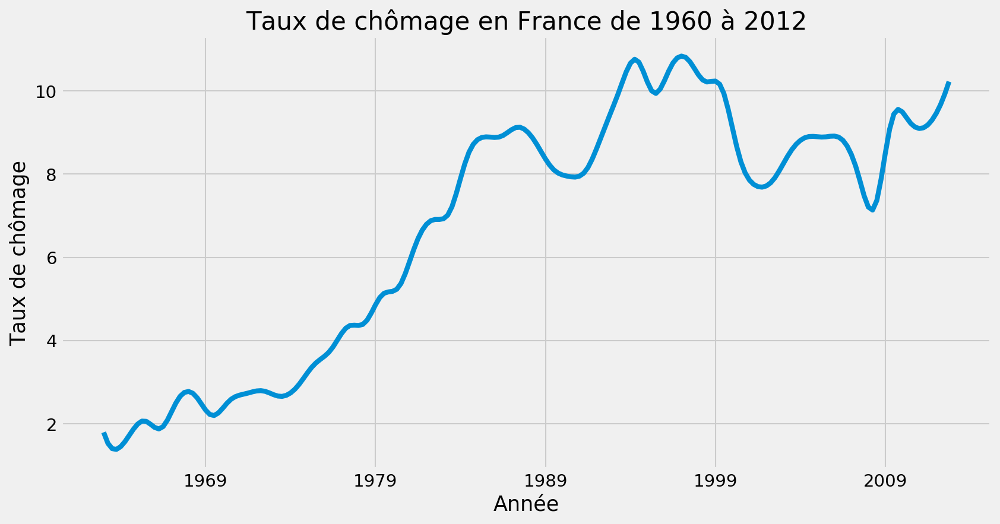


Il semble bien que depuis 1960, le taux de chômage en France ne cesse de croître. On observe une baisse nette vers les années 2008 avant que le taux de chômage ne reprenne de croître.

Regardons maintenant l'évolution du travail et du capital sur la même période.


```python
base[["K", "L"]].plot()
plt.title("Evolution du travail (L) et du capital (K) entre 1960-2012")
```


    Text(0.5, 1.0, 'Evolution du travail (L) et du capital (K) entre 1960-2012')


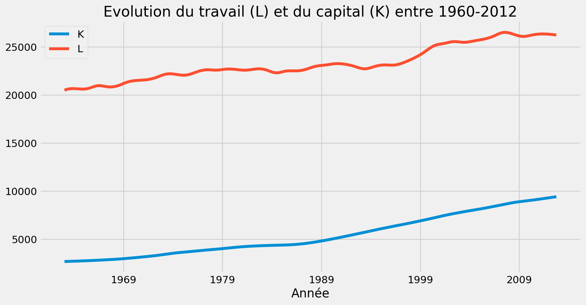


Essayons de tester la courbe de Phillips.  
Phillips était un économiste keynésien du XXè siècle, il est connu pour sa courbe qui prédisait que le taux d'inflation corrèlait négativement avec le taux de chômage. Pour lui donc, plus il y a de l'inflation, moins il y a du chômage. Essayons donc de voir l'évolution de ces indicateurs dans le temps et représentons un nuage de point pour voir leur correlation


```python
base[["TCHO", "TINFL"]].plot()
plt.title(" Evolution des taux d'inflation (TINFL) et du taux de chômage (TCHO)")
```


    Text(0.5, 1.0, " Evolution des taux d'inflation (TINFL) et du taux de chômage (TCHO)")


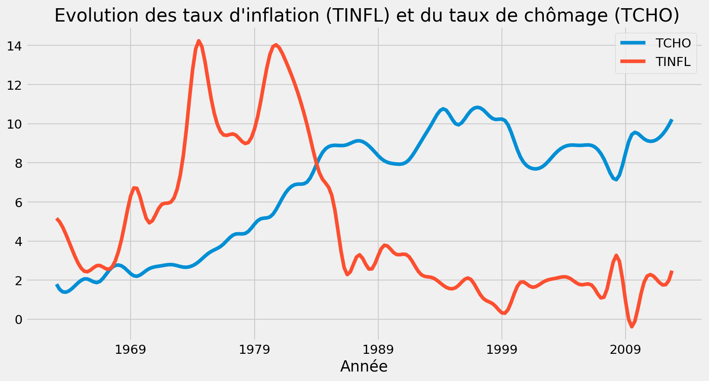


On observe que sur cette période les taux d'inflation et de chômage fluctuent fortement. Ils se coupent deux fois, une fois première vers les années 65 à un moment où les dux taux sont très bas et une deuxième vers les années 1980.


```python
# Correlation
sns.scatterplot(x= "TCHO", y = "TINFL", data = base)
plt.title("Nuage de points entre taux de chômage et taux d'inflation")
plt.xlabel("Taux de chômage en %")
plt.ylabel("Taux d'inflation en %")
```


    Text(0, 0.5, "Taux d'inflation en %")


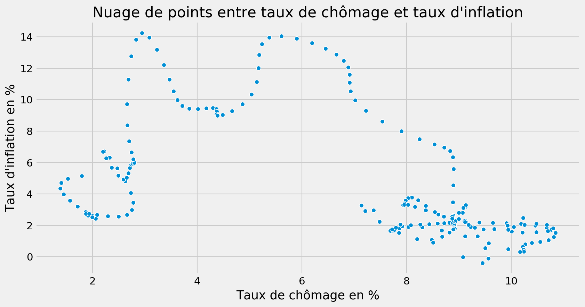


Il ne smble pas y avoir une relation évidente entre ces deux variables. Les deux n'évoluent ni dans le même sens ni dans le sens inverse.

Regardons les densités de ces deux variables


```python
sns.kdeplot(base["TCHO"])
sns.kdeplot(base["TINFL"])
plt.title("Densité des taux de chômage et taux d'inflation")
```


    Text(0.5, 1.0, "Densité des taux de chômage et taux d'inflation")


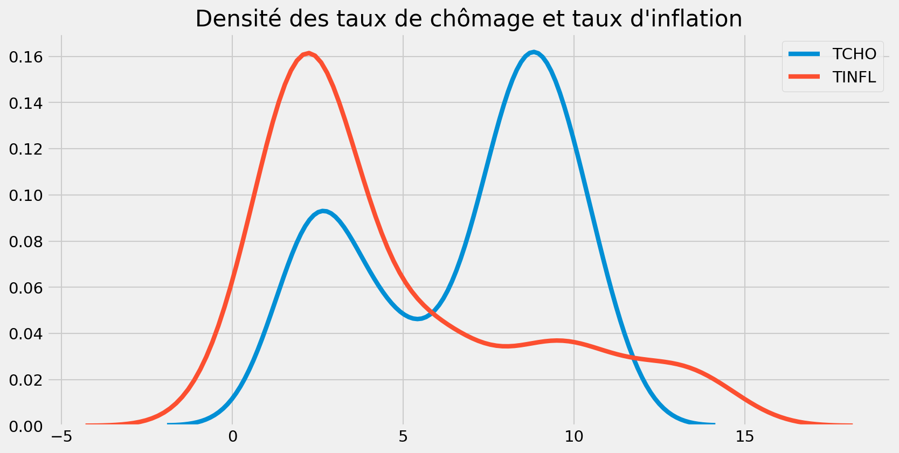


Le taux de chômage a une répartition bimodale tandis que le taux d'inflation est unimodal.

C'est quoi le lien entre le taux de chômage et la population active? 


```python
sns.scatterplot(x = "TCHO", y = "PAP", data = base)
plt.title("Taux de chômage vs. Population active")
plt.xlabel("Taux de chômage")
plt.ylabel("Population active")
```


    Text(0, 0.5, 'Population active')


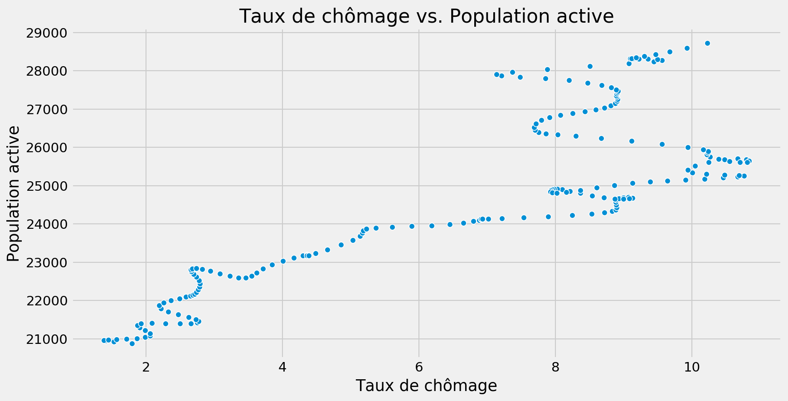


```python
base[["POP", "PAP"]].plot()
plt.title("Evolution de la population active (PAP) et de la population totale (POP)")
```


    Text(0.5, 1.0, 'Evolution de la population active (PAP) et de la population totale (POP)')


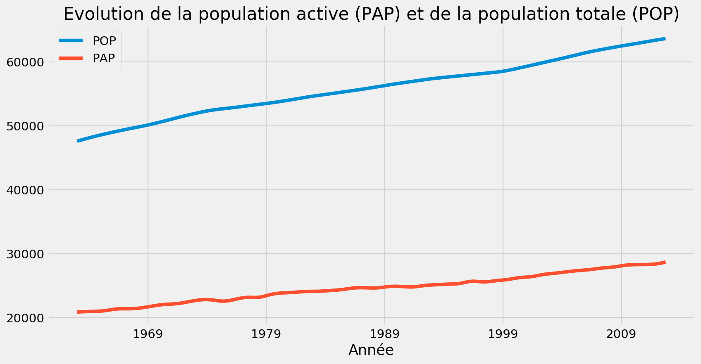


Comment évolue la dette publique?


```python
base["DP"].plot()
plt.title("Evolution de la dette publique en Milliard d'€")
plt.show()
```


la dette publique a une augmentation exponentielle avec le temps. Une très légère baisse s'observe vers 2008 mais le cours de l'augmentation reprend toute juste après


```python
base["TPRES"].plot()
plt.title("Taux de prélèvement obligatoire en % ")
```


    Text(0.5, 1.0, 'Taux de prélèvement obligatoire en % ')


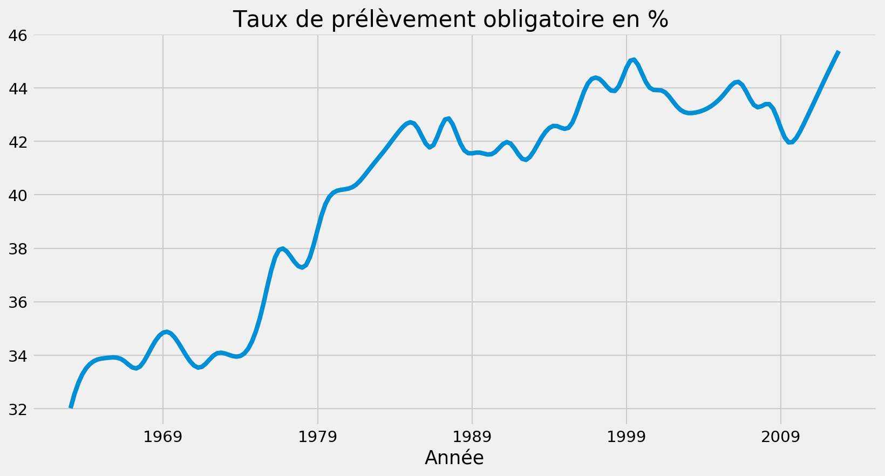


La France est l'un des pays qui ont les taux de prélèvements obligatoires très élevés au monde. SUr ce graphique, on observe que ce n'était pas le cas au début des années 1960.


```python
base[["PY", "PC"]].plot()
plt.title("Evolution des prix de la production (PY) et prix de la consommation")
plt.show()
```


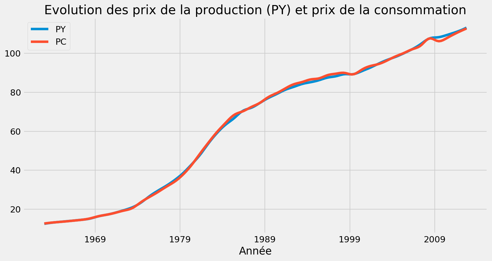


Ces deux sont évoluent très étroitement.

# Estimation d'une fonction de la consommation keynésienne

## Première estimation : modèle double linéaire

La fonction de consommation keynésienne se présente comme suit:
\begin{equation*}
C = C_0 + _c * y^d
\end{equation*}

La consommation C est égale à la comsommation incompréssible (le niveau de consommation quand le revenu est égal à 0) + la propension marginale à consommer multipliée par le revenu disponible. 

Nous allons estimer cette fonction grâce à notre base de donnée


```python
import numpy as np
```


```python
import statsmodels.api as sm
```

La notation matricielle d'une équation économétrique se présente comme suit :   
\begin{equation*}
y = cste + X + \epsilon\
\end{equation*}


```python
# Choisissons y notre variable endogène: celle qu'on veut expliquer. Ici c'est la consommation
y = base["CPC"]
```


```python
# Trouvons X la matrice des variables exogènes; dans ce cas on ne prend que le revenu disponible
X = base["RD"]
# Ajoutons une constante à la base
X = sm.add_constant(X)
```


```python
# Estimons
premiere_estimation = sm.OLS(endog= y, exog= X).fit()
```


```python
premiere_estimation.summary()
```


<table class="simpletable">
<caption>OLS Regression Results</caption>
<tr>
  <th>Dep. Variable:</th>           <td>CPC</td>       <th>  R-squared:         </th> <td>   0.992</td> 
</tr>
<tr>
  <th>Model:</th>                   <td>OLS</td>       <th>  Adj. R-squared:    </th> <td>   0.992</td> 
</tr>
<tr>
  <th>Method:</th>             <td>Least Squares</td>  <th>  F-statistic:       </th> <td>2.485e+04</td>
</tr>
<tr>
  <th>Date:</th>             <td>Tue, 19 Feb 2019</td> <th>  Prob (F-statistic):</th> <td>4.49e-210</td>
</tr>
<tr>
  <th>Time:</th>                 <td>21:23:43</td>     <th>  Log-Likelihood:    </th> <td> -877.87</td> 
</tr>
<tr>
  <th>No. Observations:</th>      <td>   200</td>      <th>  AIC:               </th> <td>   1760.</td> 
</tr>
<tr>
  <th>Df Residuals:</th>          <td>   198</td>      <th>  BIC:               </th> <td>   1766.</td> 
</tr>
<tr>
  <th>Df Model:</th>              <td>     1</td>      <th>                     </th>     <td> </td>    
</tr>
<tr>
  <th>Covariance Type:</th>      <td>nonrobust</td>    <th>                     </th>     <td> </td>    
</tr>
</table>
<table class="simpletable">
<tr>
    <td></td>       <th>coef</th>     <th>std err</th>      <th>t</th>      <th>P>|t|</th>  <th>[0.025</th>    <th>0.975]</th>  
</tr>
<tr>
  <th>const</th> <td>  -94.0566</td> <td>    5.029</td> <td>  -18.702</td> <td> 0.000</td> <td> -103.974</td> <td>  -84.139</td>
</tr>
<tr>
  <th>RD</th>    <td>    1.0772</td> <td>    0.007</td> <td>  157.627</td> <td> 0.000</td> <td>    1.064</td> <td>    1.091</td>
</tr>
</table>
<table class="simpletable">
<tr>
  <th>Omnibus:</th>       <td> 5.737</td> <th>  Durbin-Watson:     </th> <td>   0.034</td>
</tr>
<tr>
  <th>Prob(Omnibus):</th> <td> 0.057</td> <th>  Jarque-Bera (JB):  </th> <td>   5.557</td>
</tr>
<tr>
  <th>Skew:</th>          <td>-0.321</td> <th>  Prob(JB):          </th> <td>  0.0621</td>
</tr>
<tr>
  <th>Kurtosis:</th>      <td> 3.504</td> <th>  Cond. No.          </th> <td>2.67e+03</td>
</tr>
</table><br/><br/>Warnings:<br/>[1] Standard Errors assume that the covariance matrix of the errors is correctly specified.<br/>[2] The condition number is large, 2.67e+03. This might indicate that there are<br/>strong multicollinearity or other numerical problems.


A l'estimation de ce modèle on retrouve des un résultat surprenant. La constante qui est supposée être notre consommation incompressible est négtive, économétriquement ces résultats sont bons (R² proche de 1, p-values des deux coefficients très faibles) mais on observe bien que la théorie économique sous-jacente n'est pas vérifiée. De plus la valeur du `Durbin-Watson` est loin de 2, ce qui signifie qu'il existe une autocorrelation des résidus. 

Il nous faut donc transformer les variables.

### Traitement des erreurs


```python
from scipy import stats
```


```python
premiere_estimation.resid.plot()
plt.title("Erreurs d'estimation")
```


    Text(0.5, 1.0, "Erreurs d'estimation")


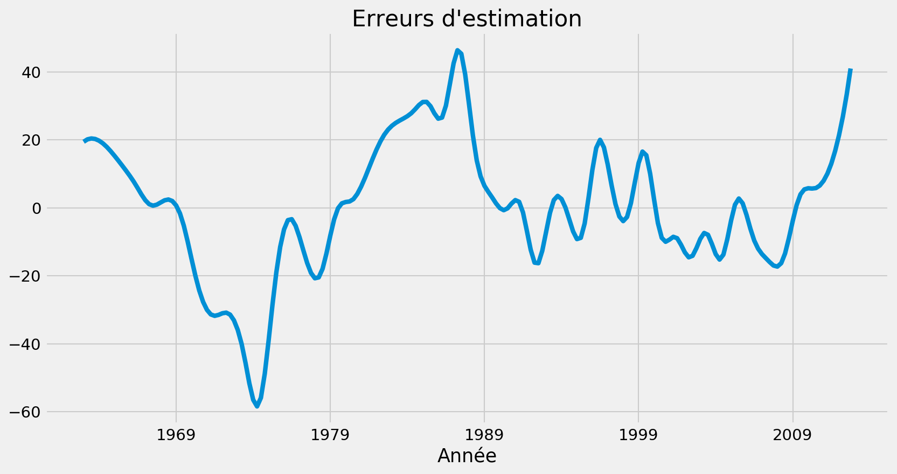


```python
stats.shapiro(premiere_estimation.resid)
```


    (0.9824138879776001, 0.013233800418674946)


```python
from matplotlib.ticker import NullFormatter 
plt.style.use("seaborn")
plt.figure(1, dpi = 120)

# Residuals vs. Predicted values
plt.subplot(221)
plt.scatter(premiere_estimation.fittedvalues, base["CPC"])
plt.title("Valeurs prédites vs. Valeurs observées")
plt.xlabel("Valeurs prédites")
plt.ylabel("Valeurs observées")
plt.grid(True)

# Predicted values vs. Residuals
plt.subplot(222)
plt.scatter(premiere_estimation.fittedvalues, premiere_estimation.resid)
plt.title("Valeurs prédites vs. Résidus")
plt.xlabel("Valeurs prédites")
plt.ylabel("Résidus")
plt.grid(True)

# Residuals
plt.subplot(223)
sns.distplot(premiere_estimation.resid)
plt.grid(True)

plt.gca().yaxis.set_minor_formatter(NullFormatter())
```


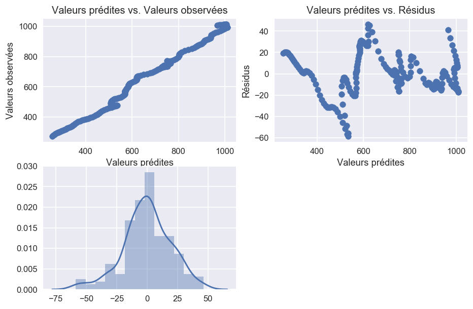


```python
plt.style.use("fivethirtyeight")
sm.qqplot(premiere_estimation.resid)
```


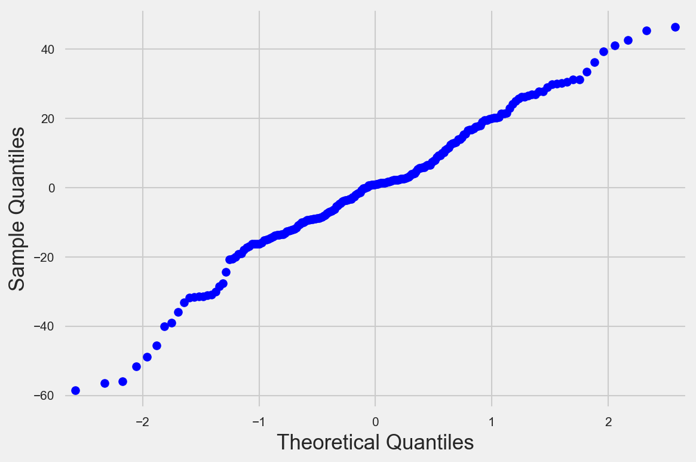


```python
sns.kdeplot(premiere_estimation.resid)
```


    <matplotlib.axes._subplots.AxesSubplot at 0x1e9d8e7aac8>


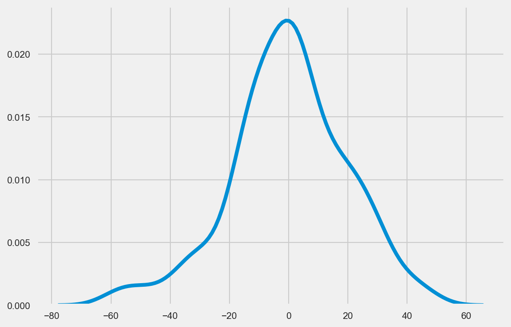


## Deuxième estimation : modèle semi-linéaire

Dans ce modèle, nous allons transformer la variable exogène pour la linéariser


```python
X = np.log(X)
```


```python
# Estimons
seconde_estimation = sm.OLS(endog= y, exog= X).fit()
```


```python
seconde_estimation.summary()
```


<table class="simpletable">
<caption>OLS Regression Results</caption>
<tr>
  <th>Dep. Variable:</th>           <td>CPC</td>       <th>  R-squared:         </th> <td>   0.929</td> 
</tr>
<tr>
  <th>Model:</th>                   <td>OLS</td>       <th>  Adj. R-squared:    </th> <td>   0.928</td> 
</tr>
<tr>
  <th>Method:</th>             <td>Least Squares</td>  <th>  F-statistic:       </th> <td>   2590.</td> 
</tr>
<tr>
  <th>Date:</th>             <td>Tue, 19 Feb 2019</td> <th>  Prob (F-statistic):</th> <td>4.78e-116</td>
</tr>
<tr>
  <th>Time:</th>                 <td>21:23:46</td>     <th>  Log-Likelihood:    </th> <td> -1330.9</td> 
</tr>
<tr>
  <th>No. Observations:</th>      <td>   200</td>      <th>  AIC:               </th> <td>   2664.</td> 
</tr>
<tr>
  <th>Df Residuals:</th>          <td>   199</td>      <th>  BIC:               </th> <td>   2667.</td> 
</tr>
<tr>
  <th>Df Model:</th>              <td>     1</td>      <th>                     </th>     <td> </td>    
</tr>
<tr>
  <th>Covariance Type:</th>      <td>nonrobust</td>    <th>                     </th>     <td> </td>    
</tr>
</table>
<table class="simpletable">
<tr>
    <td></td>       <th>coef</th>     <th>std err</th>      <th>t</th>      <th>P>|t|</th>  <th>[0.025</th>    <th>0.975]</th>  
</tr>
<tr>
  <th>const</th> <td>         0</td> <td>        0</td> <td>      nan</td> <td>   nan</td> <td>        0</td> <td>        0</td>
</tr>
<tr>
  <th>RD</th>    <td>  103.8591</td> <td>    2.041</td> <td>   50.893</td> <td> 0.000</td> <td>   99.835</td> <td>  107.883</td>
</tr>
</table>
<table class="simpletable">
<tr>
  <th>Omnibus:</th>       <td>63.669</td> <th>  Durbin-Watson:     </th> <td>   0.000</td>
</tr>
<tr>
  <th>Prob(Omnibus):</th> <td> 0.000</td> <th>  Jarque-Bera (JB):  </th> <td>  10.656</td>
</tr>
<tr>
  <th>Skew:</th>          <td> 0.011</td> <th>  Prob(JB):          </th> <td> 0.00485</td>
</tr>
<tr>
  <th>Kurtosis:</th>      <td> 1.869</td> <th>  Cond. No.          </th> <td>     inf</td>
</tr>
</table><br/><br/>Warnings:<br/>[1] Standard Errors assume that the covariance matrix of the errors is correctly specified.<br/>[2] The smallest eigenvalue is      0. This might indicate that there are<br/>strong multicollinearity problems or that the design matrix is singular.


Ce modèle est encore plus pire que le dernier que nous avons estimé. Nous allons ajouter effectuer des transformations puis réestimer.

## Modèle double log avec variable de retard

Dans un modèle avec une variable de retard on décale d'un rang notre variable endogène et on l'introduit dans le modèle comme variable explicative.
\begin{equation*}
y_t =y_t-_1  + X + epsilon
\end{equation*}


```python
nouvelle_base = base[["CPC", "RD"]]
nouvelle_base["log_rd"] = np.log(nouvelle_base["RD"])
nouvelle_base["log_y"] = np.log(nouvelle_base["CPC"])
nouvelle_base["y_retardée"] = np.roll(nouvelle_base["log_y"], shift= -1)
nouvelle_base.head()
```


<div>
<style scoped>
    .dataframe tbody tr th:only-of-type {
        vertical-align: middle;
    }

    .dataframe tbody tr th {
        vertical-align: top;
    }

    .dataframe thead th {
        text-align: right;
    }
</style>
<table border="1" class="dataframe">
  <thead>
    <tr style="text-align: right;">
      <th></th>
      <th>CPC</th>
      <th>RD</th>
      <th>log_rd</th>
      <th>log_y</th>
      <th>y_retardée</th>
    </tr>
    <tr>
      <th>Année</th>
      <th></th>
      <th></th>
      <th></th>
      <th></th>
      <th></th>
    </tr>
  </thead>
  <tbody>
    <tr>
      <th>1963-01-31</th>
      <td>274.252399</td>
      <td>323.844394</td>
      <td>5.780263</td>
      <td>5.614049</td>
      <td>5.634718</td>
    </tr>
    <tr>
      <th>1963-04-30</th>
      <td>279.979818</td>
      <td>328.496646</td>
      <td>5.794527</td>
      <td>5.634718</td>
      <td>5.652128</td>
    </tr>
    <tr>
      <th>1963-07-31</th>
      <td>284.897175</td>
      <td>332.822369</td>
      <td>5.807609</td>
      <td>5.652128</td>
      <td>5.666878</td>
    </tr>
    <tr>
      <th>1963-10-31</th>
      <td>289.130436</td>
      <td>336.893221</td>
      <td>5.819766</td>
      <td>5.666878</td>
      <td>5.679329</td>
    </tr>
    <tr>
      <th>1964-01-31</th>
      <td>292.752877</td>
      <td>340.720822</td>
      <td>5.831063</td>
      <td>5.679329</td>
      <td>5.690124</td>
    </tr>
  </tbody>
</table>
</div>


```python
y = nouvelle_base["log_y"]
X = nouvelle_base[["y_retardée", "log_rd"]]
```


```python
# Ajoutons la constante 
X = sm.add_constant(X)
```


```python
# Estimons le modèle
troisieme_modele = sm.OLS(endog= y, exog = X).fit()
```


```python
troisieme_modele.summary()
```


<table class="simpletable">
<caption>OLS Regression Results</caption>
<tr>
  <th>Dep. Variable:</th>          <td>log_y</td>      <th>  R-squared:         </th> <td>   0.992</td> 
</tr>
<tr>
  <th>Model:</th>                   <td>OLS</td>       <th>  Adj. R-squared:    </th> <td>   0.991</td> 
</tr>
<tr>
  <th>Method:</th>             <td>Least Squares</td>  <th>  F-statistic:       </th> <td>1.153e+04</td>
</tr>
<tr>
  <th>Date:</th>             <td>Tue, 19 Feb 2019</td> <th>  Prob (F-statistic):</th> <td>8.04e-205</td>
</tr>
<tr>
  <th>Time:</th>                 <td>21:23:46</td>     <th>  Log-Likelihood:    </th> <td>  394.89</td> 
</tr>
<tr>
  <th>No. Observations:</th>      <td>   200</td>      <th>  AIC:               </th> <td>  -783.8</td> 
</tr>
<tr>
  <th>Df Residuals:</th>          <td>   197</td>      <th>  BIC:               </th> <td>  -773.9</td> 
</tr>
<tr>
  <th>Df Model:</th>              <td>     2</td>      <th>                     </th>     <td> </td>    
</tr>
<tr>
  <th>Covariance Type:</th>      <td>nonrobust</td>    <th>                     </th>     <td> </td>    
</tr>
</table>
<table class="simpletable">
<tr>
       <td></td>         <th>coef</th>     <th>std err</th>      <th>t</th>      <th>P>|t|</th>  <th>[0.025</th>    <th>0.975]</th>  
</tr>
<tr>
  <th>const</th>      <td>   -1.0456</td> <td>    0.055</td> <td>  -19.005</td> <td> 0.000</td> <td>   -1.154</td> <td>   -0.937</td>
</tr>
<tr>
  <th>y_retardée</th> <td>    0.1077</td> <td>    0.025</td> <td>    4.300</td> <td> 0.000</td> <td>    0.058</td> <td>    0.157</td>
</tr>
<tr>
  <th>log_rd</th>     <td>    1.0428</td> <td>    0.029</td> <td>   35.601</td> <td> 0.000</td> <td>    0.985</td> <td>    1.101</td>
</tr>
</table>
<table class="simpletable">
<tr>
  <th>Omnibus:</th>       <td>22.033</td> <th>  Durbin-Watson:     </th> <td>   0.119</td>
</tr>
<tr>
  <th>Prob(Omnibus):</th> <td> 0.000</td> <th>  Jarque-Bera (JB):  </th> <td>  81.919</td>
</tr>
<tr>
  <th>Skew:</th>          <td> 0.255</td> <th>  Prob(JB):          </th> <td>1.63e-18</td>
</tr>
<tr>
  <th>Kurtosis:</th>      <td> 6.093</td> <th>  Cond. No.          </th> <td>    233.</td>
</tr>
</table><br/><br/>Warnings:<br/>[1] Standard Errors assume that the covariance matrix of the errors is correctly specified.


```python
troisieme_modele.resid.plot()
```


    <matplotlib.axes._subplots.AxesSubplot at 0x1e9d8e52c88>


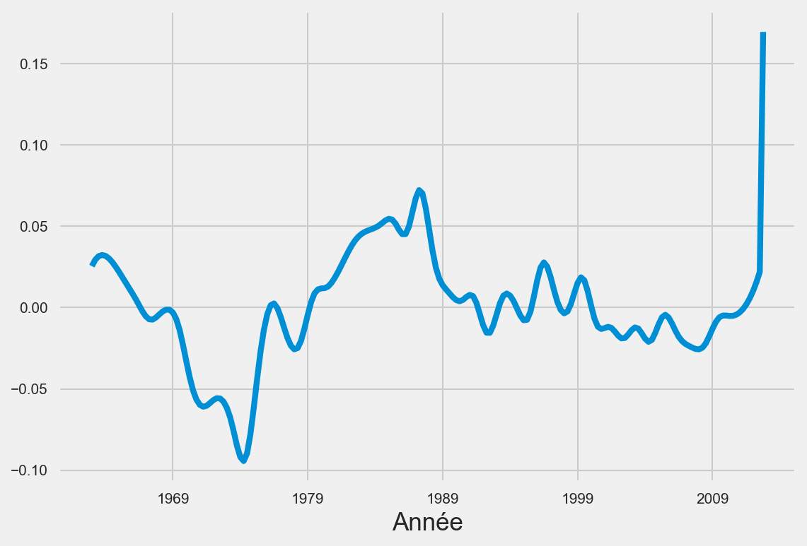


Les erreurs ne sont toujours pas bruit blanc, pour améliorer la capacité du modèle à expliquer la réalité il nous faudra ajouter d'autres explicatives. Ce modèle était simpliste.  
Avant de finir j'aimerais vous montrer la règle d'interprétation d'un tel modèle. Etant donnée qu'on a regressé un modèle log-log, les coefficients s'interprêront comme une élasticité.  
Dans ce modèle en l'occurence, l'augmentation du revenu disponible d'un 1% entraîne l'augmentation de la consommation de 1.04%
